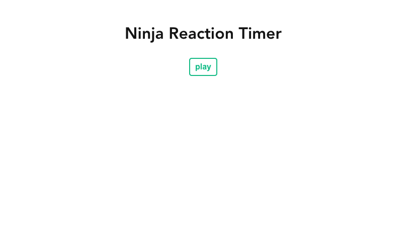
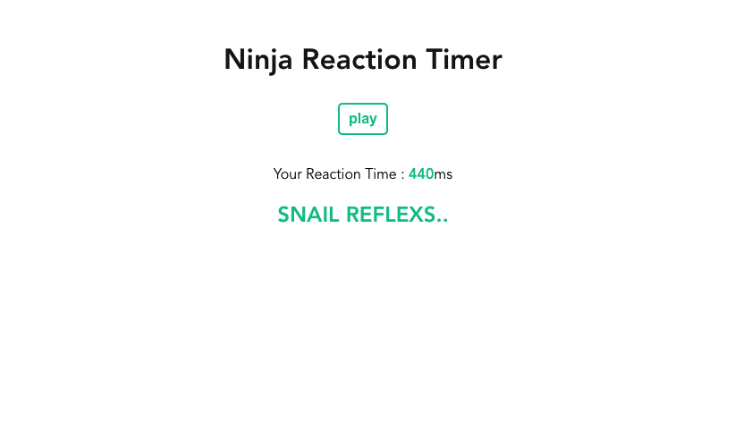

# 6. Reaction Game (Vue.js)
## Screenshots

## Features
- Block appears after a random amount of time between 2 and 7 seconds
- Player tries to click the block as fast as possible
- Reaction time is measured and displayed
- Different rank messages are displayed according to the reaction time

## Skills
- HTML
- CSS
- JS
- Vue.js